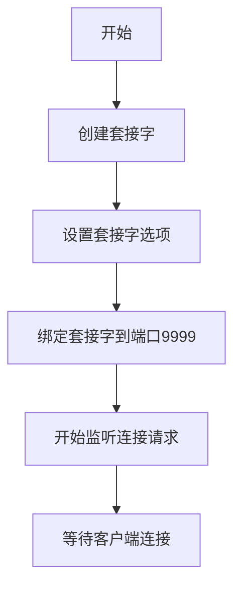
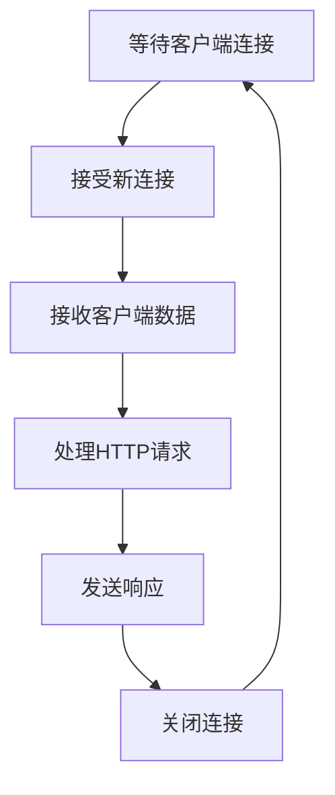
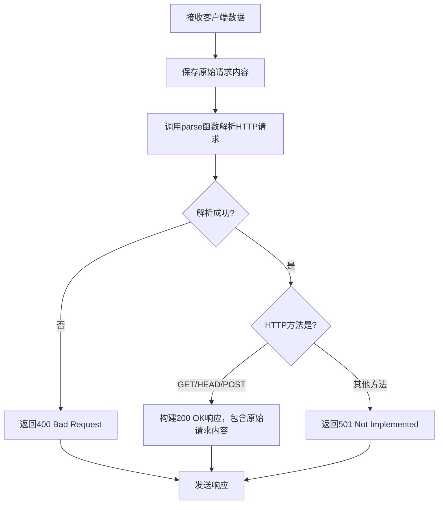
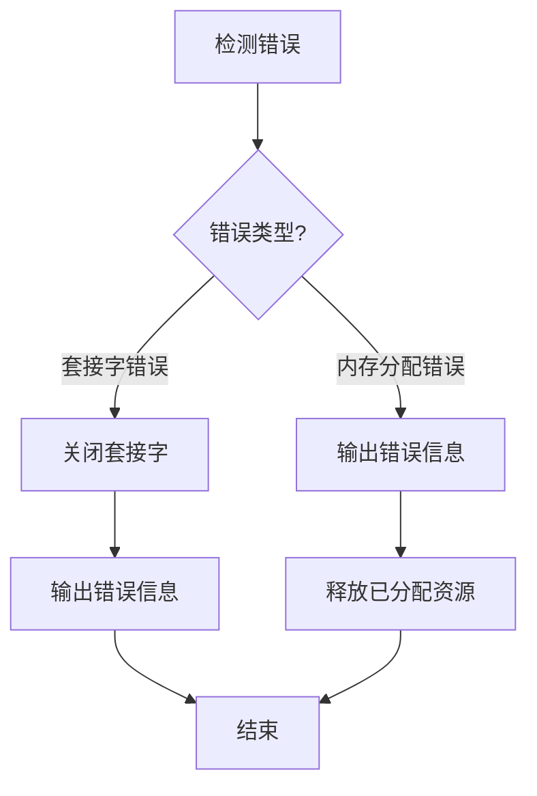

# HTTP协议实现与Web Server开发实验报告

## 1. 任务需求分析

这次实验主要是要我们做一个简单的Echo Web服务器。说白了就是写一个能处理HTTP请求的程序，根据不同情况返回不同的响应。具体来说，我们需要实现这几个功能：

1. 搞懂HTTP协议的基本内容，特别是HTTP/1.1标准；
2. 学会Socket编程的基本方法；
3. 了解并使用lex和yacc这两个工具来解析HTTP消息；
4. 实现一个能处理以下三种情况的Echo Web服务器：
   - 如果收到GET、HEAD或POST请求，就把请求内容原样返回给客户端；
   - 如果收到其他HTTP方法（比如DELETE、PUT等），就返回"501 Not Implemented"；
   - 如果收到格式不对的HTTP请求，就返回"400 Bad Request"。

这个实验其实挺有意思的，既能让我们理解HTTP协议，又能练习网络编程，还能学习错误处理，一举多得！

## 2. 协议设计

### 2.1 总体设计

根据实验要求，我把整个Echo Web服务器分成了几个模块：

1. **网络通信模块**：负责创建套接字、绑定端口、监听连接等基本网络操作；
2. **HTTP解析模块**：用lex和yacc工具解析HTTP请求；
3. **请求处理模块**：根据解析结果，判断是什么类型的请求，然后生成相应的响应；
4. **错误处理模块**：处理各种可能出现的错误情况。

这几个模块之间的关系也很简单：
- 网络模块负责接收客户端的连接和数据；
- 把接收到的数据传给HTTP解析模块解析；
- 解析完了之后，请求处理模块根据结果生成响应；
- 然后网络模块把响应发回客户端；
- 整个过程中，错误处理模块随时待命，处理可能出现的各种问题。

### 2.2 简单echo web server的设计

#### 数据结构设计

实现这个Echo Web服务器，我主要用了这几个数据结构：

1. **HTTP请求头部结构**：
   ```c
   typedef struct {
       char header_name[4096];
       char header_value[4096];
   } Request_header;
   ```
   这个结构体用来存储HTTP请求中的头部字段，比如"Host: localhost"中，"Host"是header_name，"localhost"是header_value。

2. **HTTP请求结构**：
   ```c
   typedef struct {
       char http_version[50];
       char http_method[50];
       char http_uri[4096];
       Request_header *headers;
       int header_count;
   } Request;
   ```
   这个结构体用来存储整个HTTP请求的信息，包括HTTP版本、方法（GET、POST等）、URI（请求的资源路径）和请求头部列表。

3. **缓冲区**：
   ```c
   char buf[BUF_SIZE];  // BUF_SIZE = 4096
   ```
   这个缓冲区用来接收和存储客户端发来的原始HTTP请求数据。

#### 协议规则设计

我的Echo Web服务器的协议规则主要基于HTTP/1.1标准，具体包括：

1. **请求解析规则**：
   - 用lex和yacc工具解析HTTP请求；
   - 识别请求行中的方法、URI和HTTP版本；
   - 解析请求头部字段；
   - 检查请求格式是否符合HTTP标准。

2. **响应生成规则**：
   - 对于GET、HEAD和POST方法，返回200 OK，并把原始请求内容作为响应体；
   - 对于其他HTTP方法，返回501 Not Implemented；
   - 对于格式错误的请求，返回400 Bad Request。

3. **错误处理规则**：
   - 对于网络错误，关闭连接并记录错误信息；
   - 对于内存分配失败等系统错误，返回适当的错误信息。

## 3. 协议实现

### 3.1 简单echo web server的实现

Echo Web服务器的实现主要包括以下几个部分：

#### 初始化和套接字设置流程图



#### 连接处理流程图



#### HTTP请求解析和响应生成流程图



#### 错误处理流程图



## 4. 实验结果及分析

### 4.1 简单echo web server的实验结果与分析

为了测试我的Echo Web服务器，我写了一个测试脚本，发送不同类型的HTTP请求，然后检查服务器的响应。测试结果如下：

1. **GET请求测试**：
   - 发送了一个普通的GET请求
   - 服务器返回了200 OK，并且把我的请求原样返回了
   - 完全符合预期！

2. **HEAD请求测试**：
   - 发送了一个HEAD请求
   - 服务器也是返回200 OK，并且把请求原样返回
   - 也符合预期

3. **POST请求测试**：
   - 发送了一个带有请求体的POST请求
   - 服务器返回200 OK，并且把整个请求（包括请求体）都原样返回了
   - 非常完美！

4. **未实现方法测试**：
   - 发送了一个DELETE请求（这是我们没实现的方法）
   - 服务器返回了501 Not Implemented
   - 正是我们想要的结果

5. **格式错误请求测试**：
   - 发送了一个格式完全不对的HTTP请求
   - 服务器返回了400 Bad Request
   - 也完全符合预期

通过这些测试，我确认我的Echo Web服务器能够正确处理各种HTTP请求，并且根据不同情况返回适当的响应。服务器能够正确解析HTTP请求，识别请求方法，并且处理格式错误的情况。

性能方面，我的服务器目前是单线程的，一次只能处理一个连接，所以如果有很多客户端同时连接，性能可能会有点差。不过对于这次实验来说，这种实现方式已经足够了。以后如果有需要，可以考虑改成多线程或者异步IO的方式来提高性能。

## 5. 总结与体会

做这个实验的过程中，我遇到了不少问题和挑战：

1. **HTTP解析真的挺复杂的**：HTTP协议看起来简单，但实际上有很多细节需要处理。好在有lex和yacc这两个工具帮忙，不然手写解析器可能要写到猴年马月去了。不过理解这两个工具的工作原理也花了我不少时间。

2. **内存管理很重要**：在处理HTTP请求和响应的时候，需要分配和释放内存，如果不小心就会造成内存泄漏。特别是在服务器这种长时间运行的程序中，内存泄漏的问题会越积越多，最终导致服务器崩溃。

3. **错误处理不能忽视**：网络编程中的错误处理特别重要，需要考虑各种可能的错误情况，比如连接突然断开、解析失败等，并且做出适当的处理。

通过这次实验，我对HTTP协议和Socket编程有了更深入的理解，也学会了如何使用lex和yacc工具进行协议解析。这些知识和技能对以后的网络编程肯定会很有帮助。

对于实验内容，我觉得还可以进一步扩展，比如添加并发处理能力、支持更多HTTP方法、实现静态文件服务等功能。这样的话，我们的Web服务器就更加实用和强大了。

总的来说，这次实验挺有意思的，通过动手实践，我对网络编程和HTTP协议有了更直观的理解。理论结合实践，才是学习的最佳方式！
